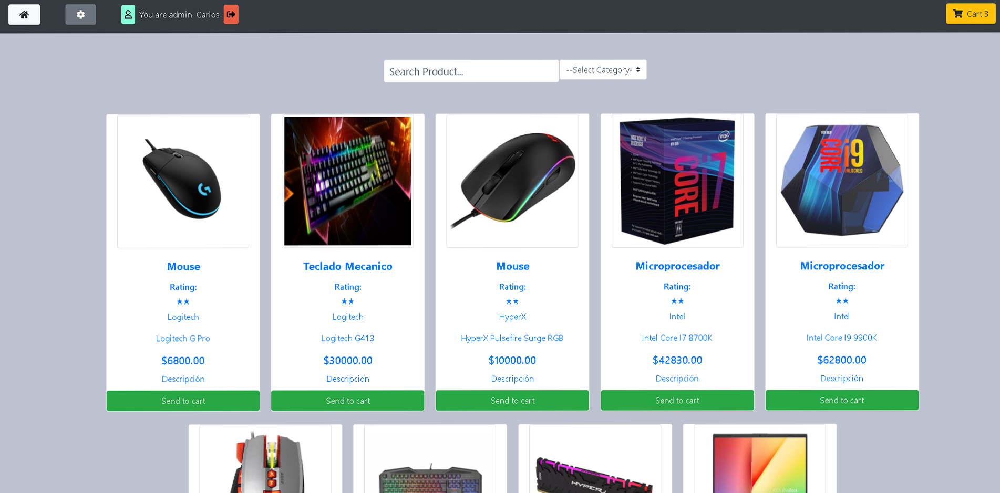
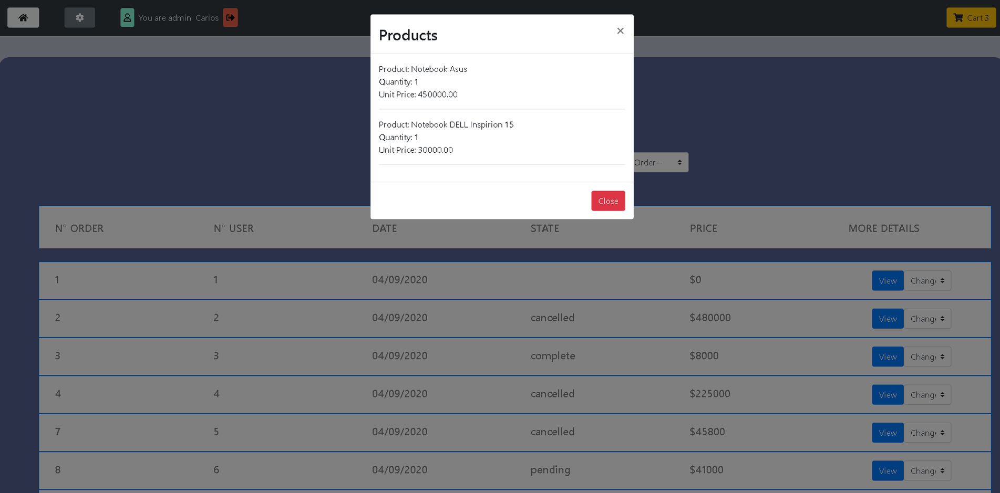
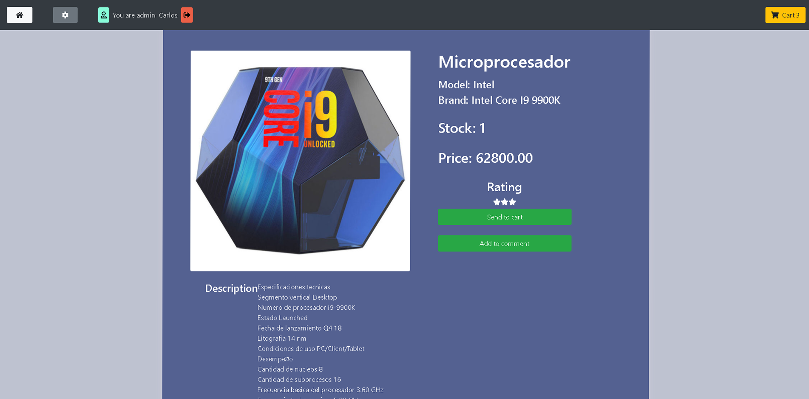
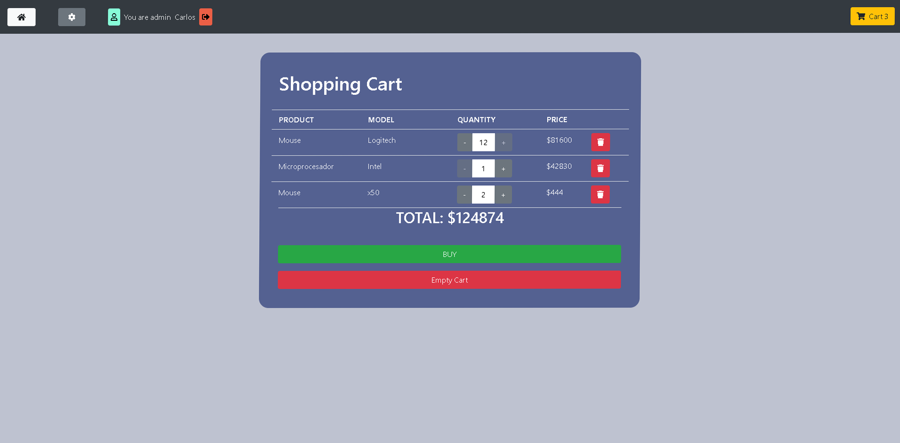
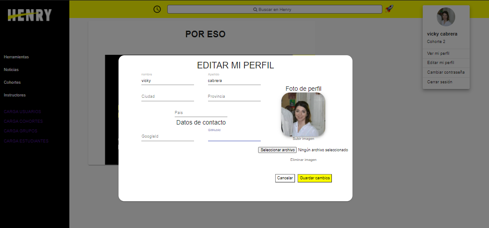
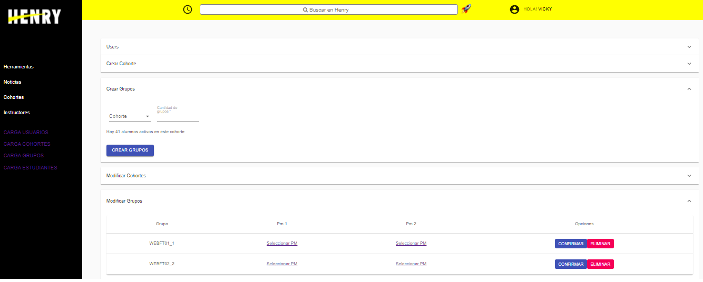
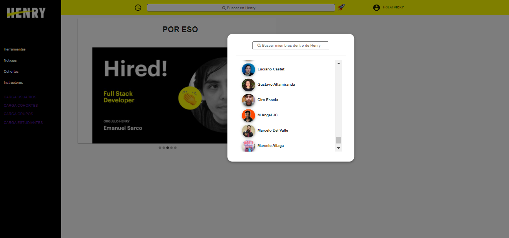

<h4><em>Hola soy Jeremias. 😊</br></em></h4>
<p>Programador Front-End en Chiper.
</p>

```javascript
const sobreMi = {
   codigo: [Javascript, HTML, CSS],
   tecnologias: {
      frontEnd: {
         js: ["React", "react-data-table-component", "Formik"],
         css: ["TailWind"]
      },
      backEnd:
         js: ["Node"],
      },
      extras: ["Adobe PhotoShop", "Adobe Illustrator", "Adobe Premiere"]
   },
   ocupacionesActuales: ["Trabajando en Chiper."],
   desafioPersonal: "Explotar cada vez menos el codigo. 🤣",
};
```
</br></br>

## Mira mi trabajo 
____________________
## E-Commerce

📌 Ecommerce dessarrollado para vender insumos de Pc.

🚀 Tecnologias: 
React - Redux - Bootstrap - NodeJS- Express - PostgreSQL - Passport






____________

## HENRY APP 

📌 Desarrollado con el objetivo de mejorar los canales administrativos de la comunidad de Henry

🚀 Tecnologias: 
React - Redux - Material UI - NodeJS- Express - PostgreSQL - Passport 

🎨 Mock-up: Adobe XD







